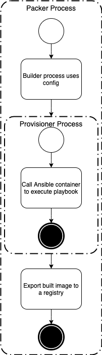

# Packer Docker Ansible

This repo uses HCL instead of JSON templates to manage the packer build process. HCL provides greater control on dynamic logic for building different images. For the installation and configuration of the VM, Packer uses Ansible. Instead of the Ansible provisioner, this pattern uses Docker as the Ansible run time environment to invoke the playbook.



## Environment Variable

These are the environment variables to set before executing the Packer process. Some variables are required for specific builders and there are columns indicating which ones.

| Variable                            | Required   | Default Value               | Description                                                   |
| ----------------------------------- | ---------- | --------------------------- | ------------------------------------------------------------- |
| ANSIBLE_PLAYBOOK_PATH               | Y          |                             | Ansible playbook path.                                        |
| BASE_CONTAINER_IMAGE                | Y          |                             | The base image for the Docker container that will be started. |
| CONTAINER_ENTRYPOINT                | N          |                             | Entrypoint to set for the container image.                    |
| CONTAINER_IMAGE_REPOSITORY          | Y          |                             | Container repository to push built image to.                  |
| CONTAINER_IMAGE_TAG                 | Y          |                             | Tag for the image.                                            |
| CONTAINER_REGISTRY_PASSWORD         | Y          |                             | Container registry password.                                  |
| CONTAINER_REGISTRY_SERVER           | Y          | https://index.docker.io/v1/ | Container registry server url.                                |
| CONTAINER_REGISTRY_USERNAME         | Y          |                             | Container registry username.                                  |
| CONTAINER_WORKING_DIRECTORY         | N          |                             | Working directory to set for the container image.             |

## Make Targets

Make file is used to manage the commands used for building images using packer. The goal of make targets is to simplify the automation commands used.

### `make docker-ansible`

This make target builds container images.

#### Setting environment variables:

```bash
$ export ANSIBLE_PLAYBOOK_PATH=somedir
$ export BASE_CONTAINER_IMAGE=python:3.9.1-buster
$ export CONTAINER_ENTRYPOINT="ENTRYPOINT /entrypoint/init"
$ export CONTAINER_IMAGE_REPOSITORY=someproject/someRepo
$ export CONTAINER_IMAGE_TAG=debian10.7-1.0.0
$ export CONTAINER_REGISTRY_PASSWORD=somePassword
$ export CONTAINER_REGISTRY_SERVER=https://index.docker.io/v1/
$ export CONTAINER_REGISTRY_USERNAME=someUserName
$ export CONTAINER_WORKING_DIRECTORY="WORKDIR /entrypoint"
$ make docker-ansible
```

#### Setting variables at command line:

```bash
$ make \
  PKR_VAR_ansible_playbook_path=somedir \
  PKR_VAR_base_container_image=python:3.9.1-buster \
  PKR_VAR_container_entrypoint="ENTRYPOINT /entrypoint/init" \
  PKR_VAR_container_image_repository=someproject/someRepo \
  PKR_VAR_container_image_tag=debian10.7-1.0.0 \
  PKR_VAR_container_registry_password=somePassword \
  PKR_VAR_container_registry_server=https://index.docker.io/v1/ \
  PKR_VAR_container_registry_username=someUserName \
  PKR_VAR_container_working_directory="WORKDIR /entrypoint" \
  docker-ansible
```

### `make clean`

Removes the cache folders and output folder generated by the packer build process.

## HCL Code Organization

- Packer leverages Go Lang's natural file block mechanism.
- The main file blocks are
    - Variables: used to expose inputs to the build process when it is invoked.
    - Locals: private variables and logic within the build process.
    - Sources: the builder type.
        - Amazon
        - Azure
        - VirtualBox
        - VMWare
        - Etc.
    - Builds: the builder logic referencing configurations defined in sources and apply provisioner logic.


## Build Process Sequence


## License

[GPLv3](LICENSE)

## References

* [Markdownlint](https://dlaa.me/markdownlint/) used to verify markdowns follow good formatting standards.
* [Software installed on GitHub-hosted runners](https://github.com/actions/virtual-environments/blob/master/images/linux/Ubuntu2004-README.md)
* [Debian ISO Download](https://cdimage.debian.org/cdimage/archive/)
* [Centos ISO Download](https://www.centos.org/download/)
